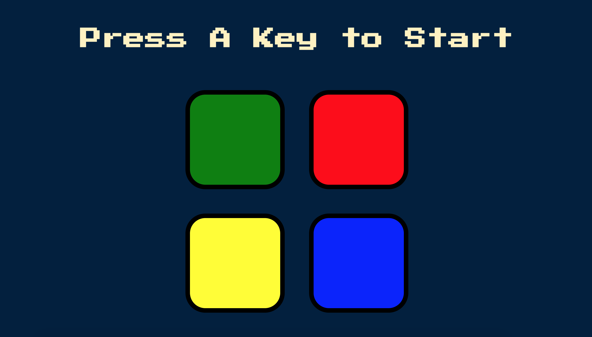
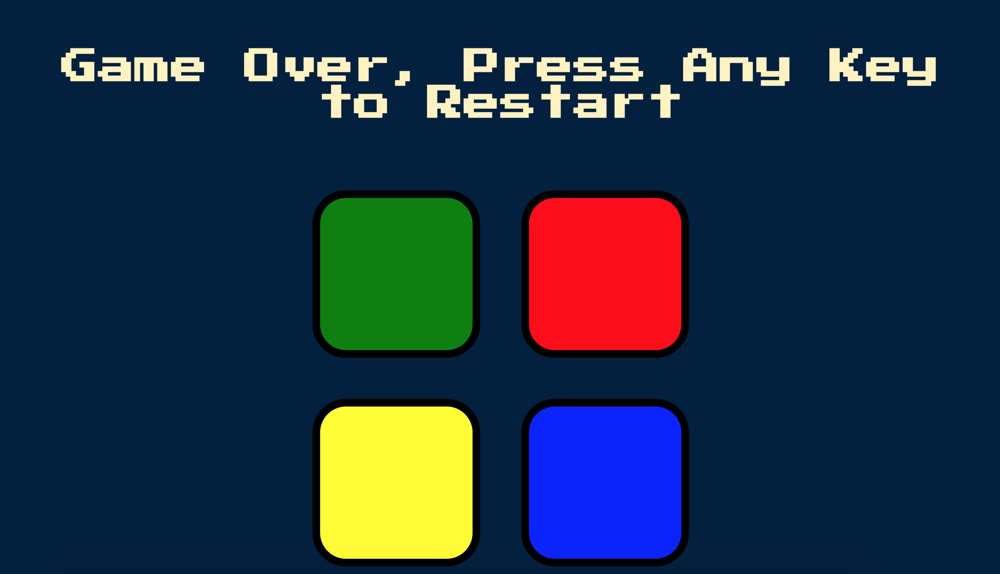

# Simon Says Game
A game created using JS, DOM manipulation, jQuery.
Created by Angela Zhang, with resources by Udemy and instructor Angela Yu.

# Installation
1. clone the repo
2. copy the path to index.html
3. paste the path in your browser, and ta-da!

# What's included
The simon-says repo is organized like so:

```text
simon-says/
└── game/
    ├── sounds/
    │   ├── blue.mp3
    │   ├── green.mp3
    │   ├── red.mp3
    │   ├── wrong.mp3
    │   └── yellow.mp3
    ├── game.js
    ├── index.html
    └── styles.css
└── media/
    ├── starting-screen.png
└── README.md
```

# Future Steps
* server-side logic that keeps track of leaderboards and player progress
* deployment with Heroku

# How to Play
1. Press any key to start.


2. Once the game has started, try your best to remember your random sequence of buttons. The game gets progressively more difficult as you have to remember longer sequences. The goal is to get to the highest level that you can.


3. If you get a sequence wrong, the screen will flash red and you will have to restart.


# Thanks
Thanks to Angela Yu and her course on Udemy for making this possible.
